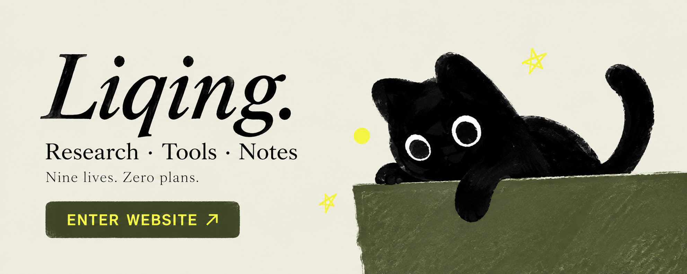

# Hi, I’m Liqing.

**Composite materials · Scientific computing · AI research workflows**

I build tools for materials analysis and turn what I learn into practical notes.  
The cat handles visitor relations. It has received several complaints.

  
   
  Click to visit my website. The cat will judge you either way.

### Things I’ve made

| Work | What it does |
| --- | --- |
| [ECC Micromechanics Calculator](https://github.com/liqinglq666/ECC-Micromechanics-Calculator) | Composite micromechanics analysis |
| [NMR Pore Analyzer](https://github.com/liqinglq666/NMR-Pore-Analyzer) | LF-NMR data and pore-structure analysis |
| [CrackVision DIC](https://github.com/liqinglq666/CrackVision-DIC) | Crack analysis and DIC workflows |
| [Liqing’s Tutorials](https://github.com/liqinglq666/Liqing-Tutorials) | Practical guides from my own research desk |

More tools and notes live on [my website ↗](https://liqinglq666.github.io/).

### Where’s the rest?

Some work is still private. The cat calls this “personal space.”

### Say hello

[Website](https://liqinglq666.github.io/) · [Email](mailto:liqinglq666@gmail.com)

Your secrets are safe. The cat wasn’t listening.
